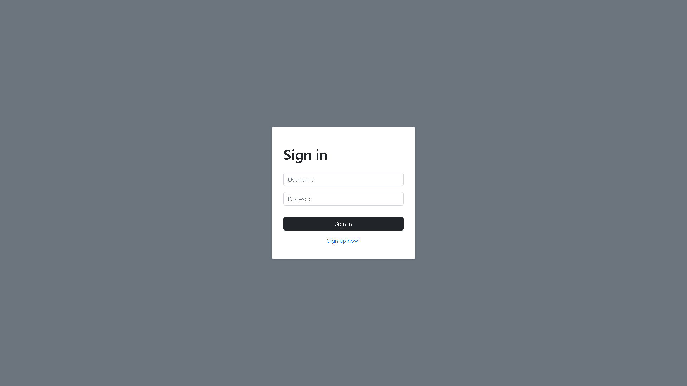
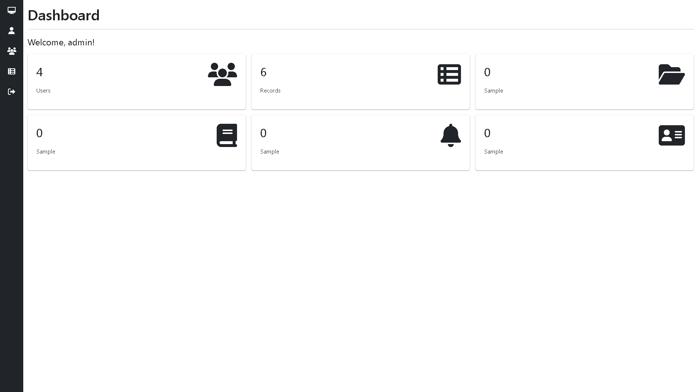
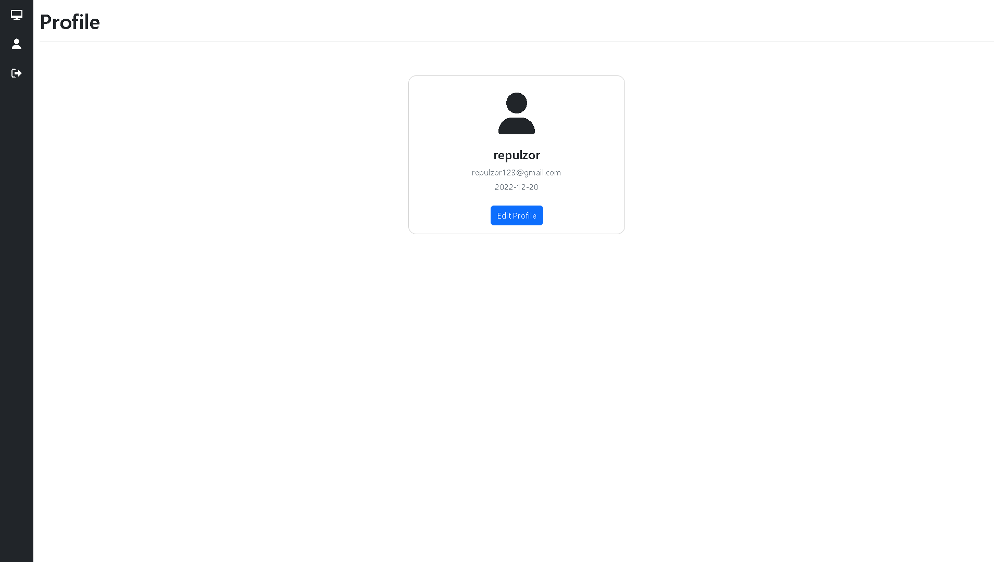
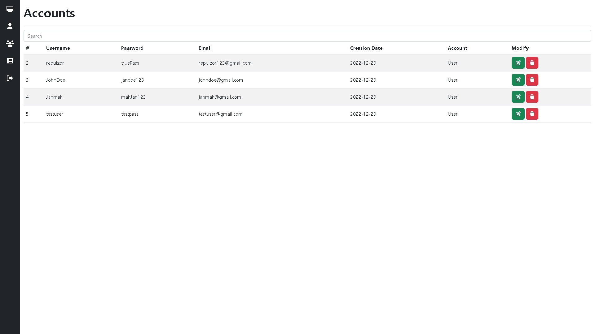
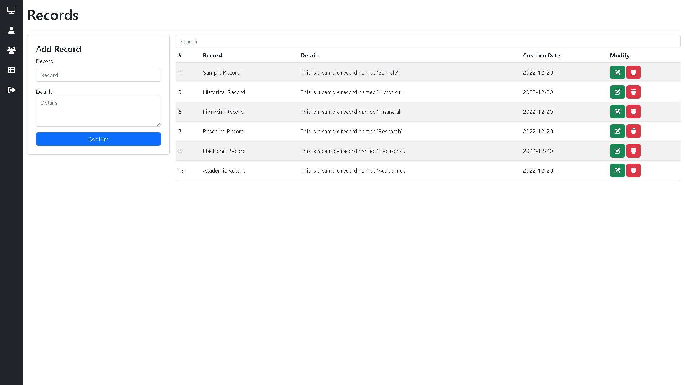

# PHP AJAX CRUD with Login Authentication

Easy to use PHP CRUD with login authentication, live search and data tables using AJAX.

## Table of contents

- [Overview](#overview)
  - [Features](#features)
  - [Screenshots](#screenshots)
  - [File Structure](#file-structure)
- [Tech Stack](#tech-stack)
  - [Languages](#built-with)
  - [Frameworks/Libraries](#frameworks/libraries)
- [Getting Started](#getting-started)
  - [Installing](#installing)
  - [How to use](#how-to-use)
- [Author](#author)

## Overview

### Features
- Login and Registration
- Page Access Validation - Prevents users to access admin only pages
- Sessions and Cookies - Auto Login and Logout
- Full CRUD Operations
- Live Data Tables with AJAX
- Live Search with AJAX
- Responsive UI

### Screenshots











### File Structure

```
php-ajax-crud-with-login-authentication/
├── assets/
│   ├── css/
│   │   └── style.css
│   ├── js/
│   │   ├── ajax/
│   │   │   ├── accounts_data.js
│   │   │   ├── profile_data.js
│   │   │   └── records_data.js
│   │   └── alerts.js
│   └── php/
│       ├── crud/
│       │   ├── accounts_crud.php
│       │   ├── profile_crud.php
│       │   └── records_crud.php
│       ├── extensions/
│       │   └── sidebar.php
│       ├── modals/
│       │   ├── accounts_modal.php
│       │   ├── profile_modal.php
│       │   └── records_modal.php
│       ├── connection.php
│       ├── dashboard_counter.php
│       ├── login.php
│       ├── login_validation.php
│       └── logout.php
├── data/
│   ├── database.sql
│   ├── extra.sql
│   ├── tb_accounts.sql
│   └── tb_records.sql
├── screenshots/
│   ├── accounts.png
│   ├── dashboard.png
│   ├── index.png
│   ├── profile.png
│   └── records.png
├── README.md
├── accounts.php
├── dashboard.php
├── index.php
├── profile.php
└── records.php
```

## Tech Stack

### Languages
- [PHP](https://www.php.net/)
- [JavaScript](https://www.javascript.com/)
- CSS

### Frameworks/Libraries
- AJAX
- [JQuery](https://jquery.com/)
- [Bootstrap](https://getbootstrap.com/)
- [SweetAlert2](https://sweetalert2.github.io/)

## Getting Started

### Installing

* Source code will be available once purchased

### How to use

* Simply open the source code with your preferred IDE
* Import all the .sql files from the data folder or use your own database
* Change connection.php to match your database configuration
* Start developing your project

## Author

- [Red Pangilinan](https://redpangilinan.github.io/portfolio/)
